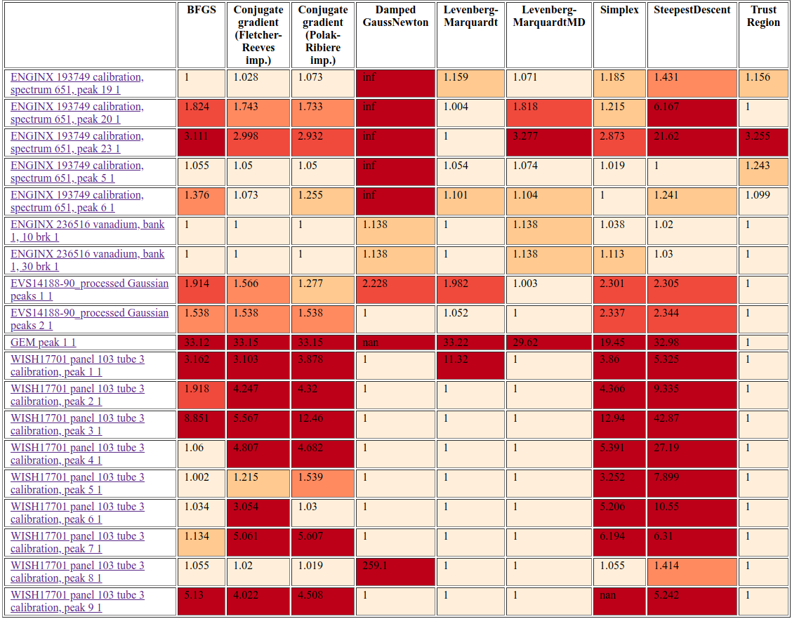
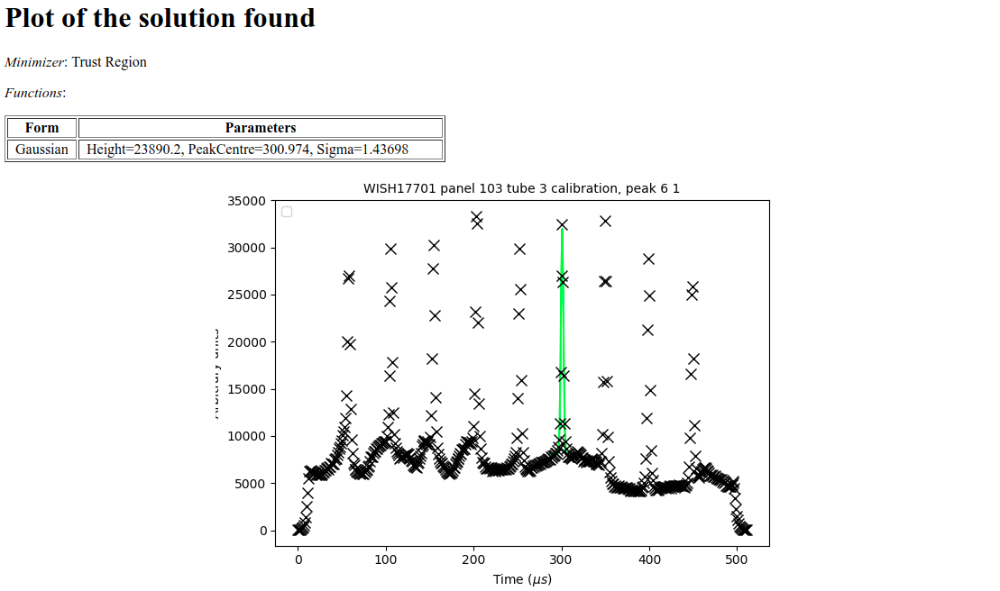

# FitBenchmarking
FitBenchmarking is a tool for comparing different minimizers/fitting software based on their accuracy and runtimes. For further documentation on FitBenchmarking see also [Wiki](https://github.com/fitbenchmarking/fitbenchmarking/wiki).

## Quick Start
 will be needed for running/installing this. Instructions for setting up python are available [here](https://github.com/mantidproject/fitbenchmarking/wiki/Setting-up-Python).

1. Download this repository or clone it using [git](https://git-scm.com/):
`git clone https://github.com/mantidproject/fitbenchmarking.git`
2. Open up a terminal (command prompt) and go into the `fitbenchmarking` directory.
3. Once you are in the right directory, type `python setup.py install`.
4. Install mantid, platform specific instructions [here](https://github.com/mantidproject/fitbenchmarking/wiki/Installing-Mantid).
5. Open the mantidpython terminal
    * Ubuntu: in a normal terminal cd to /opt/Mantid/bin and run `./mantidpython`
    * Windows: go to where you installed Mantid and search for a file called `mantidpython`
    * macOS: in a normal terminal run `/Applications/MantidPlot.app/Contents/MacOS/mantidpython`
#### For macOS only ####
6. On the mantidpython terminal, run the following IPython command:
    - `!/usr/bin/python -m pip install docutils==0.12 --user`

The above step is done to ensure that the compatible version of docutils packages (version 0.12) is installed. 

7. Finally, in this terminal, run `example_scripts/example_runScript.py`, located in the fitbenchmarking folder. This example script fit benchmarks Mantid using all the available minimizers. The resulting tables can be found in `example_scripts/results`.

## FitBenchmarking Scipy
The `example_runScripts.py` file can be changed such that it benchmarks minimizers supported by scipy instead of mantid (details provided in the file itself).

For this to work scipy version 0.17 or higher is needed (which includes needed [curve_fit](https://docs.scipy.org/doc/scipy/reference/generated/scipy.optimize.curve_fit.html) support). **The Linux distributions we have tested against so far have all included scipy 0.17+ (0.17 is from Feb 2016).**

To check your version of scipy, type `python -m pip show scipy` in the terminal(command line).

However, as of this writing, the Mantid installer on Windows is shipped with an older version of scipy
and a manual workaround is currently needed.

#### Windows workaround ####
After installing Mantid on Windows please do the following:

1. Start the mantidpython (IPython) console as admin.
2. Run the following IPython commands:
    - `!python -m pip install --upgrade pip`
    - `!python -m pip install scipy --upgrade`
    - `!python -m pip install numpy --upgrade`
3. Restart the mantidpython terminal.

Mantid on Windows is shipped with Python. The above steps can also be done from a standard command
terminal, in which case please ensure that you are upgrading against Python
installed with Mantid, which by default is located in `C:\MantidInstall\bin`.

## Description
The tool creates a table/tables that shows a comparison between the different minimizers available in a fitting software (e.g. scipy or mantid), based on their accuracy and/or runtimes.
An example of a table is:

This is the result of fitbenchmarking mantid on a set of neutron data. The results are normalised with respect to the best minimizer per problem. The problem names link to html pages that display plots of the data and the fit that was performed, together with initial and final values of the parameters. Here is an example of the final plot fit.

## Currently Benchmarking

