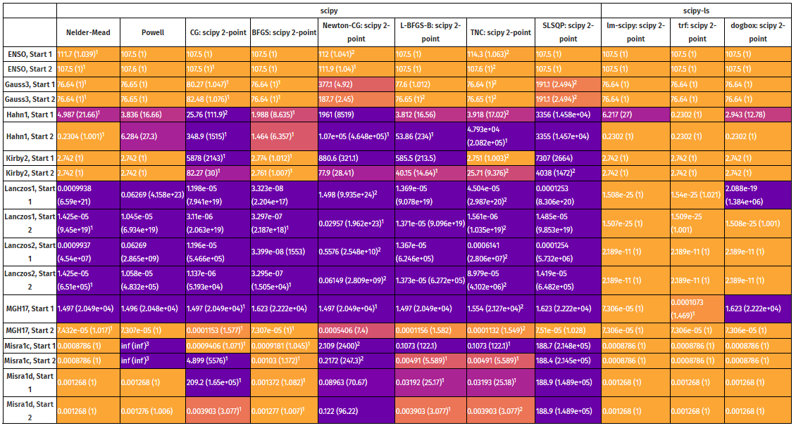
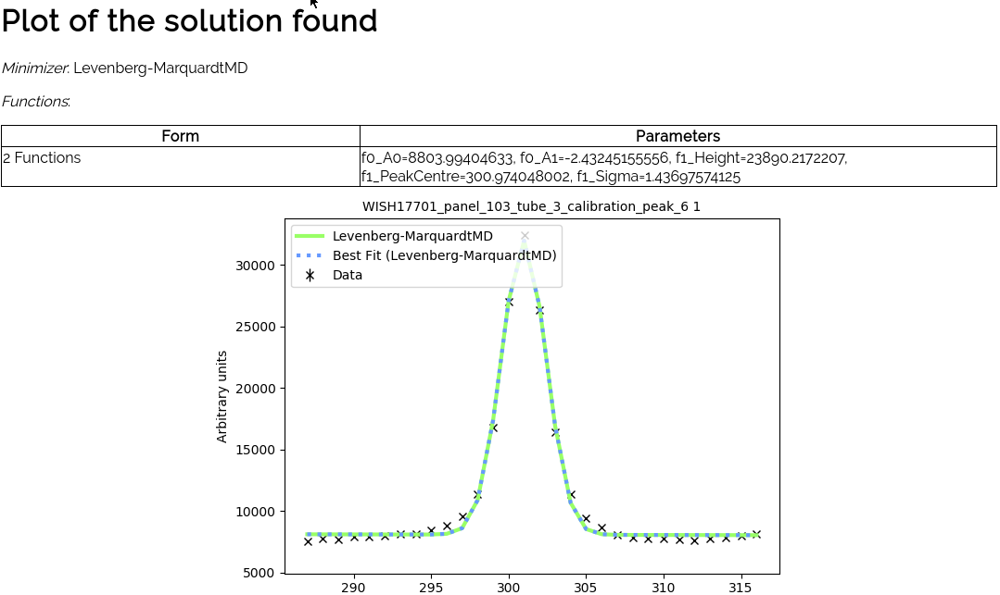

# FitBenchmarking
FitBenchmarking is a tool for comparing different minimizers/fitting software based on their accuracy and runtimes. For further documentation on FitBenchmarking see also the [documentation](fitbenchmarking.readthedocs.io)

## Quick Start
 is (currently) the Python version needed for running/installing FitBenchmarking. Instructions for setting up python are available [here](https://github.com/mantidproject/fitbenchmarking/wiki/Setting-up-Python).

For help on how to use the command line/terminal, click the hyperlink corresponding to your operating system:
[Windows](https://red-dot-geek.com/basic-windows-command-prompt-commands/),
[macOS](http://newsourcemedia.com/blog/basic-terminal-commands/) and
[Ubuntu](https://hackingpress.com/basic-linux-commands/)

### Installing
1. Download this repository or clone it using [git](https://git-scm.com/): \
    `git clone https://github.com/fitbenchmarking/fitbenchmarking.git`
2. Within a terminal (command prompt) go into the `fitbenchmarking` directory.
3. Within this directory, start the install with the following depending on your environment:

   -  No virtual environment: `python setup.py install --user`
   -  Virtual Environment: `python setup.py install`

You should now have all you need to use FitBenchmarking.
To try it out with the `fitbenchmarking` command.

## FitBenchmarking
The `fitbenchmarking` command is designed to benchmark minimizers supported by software/libraries that provide straightforward cross-platform Python install; as of now this includes DFOGN, Mantid, Minuit, SasView, SciPy, and RALFit.

The required software packages should have been installed in step 3 above.
If you have issues with any of these please contact us so that we can update the installer.

To use fitbenchmarking you will need to specify a problem to benchmark with.
The repository provides a variety of problem files in the `examples/benchmark_problems` directory.

Try it out with: `fitbenchmarking examples/benchmark_problems/simple_tests`

The resulting tables can be found in the folder `results`.

## FitBenchmarking Mantid
FitBenchmarking also works with [Mantid](https://www.mantidproject.org/Main_Page), however this is not installed by default.
To enable using Mantid, you should install it as follows:

#### Linux ####
Install mantid with:
    `python setup.py externals -s mantid`
#### Windows ####
For Windows, Mantid ships Python 2.7 with it. Although it is possible,
for now, we suggest to run FitBenchmarking, on Windows, through the
Python executable Mantid includes.
* Follow the instructions on the Mantid download page, found [here](https://download.mantidproject.org).
* This will create a Desktop icon called MantidPython
* Double click on this icon to open an IPython session
* Go into the `fitbenchmarking` directory
#### Mac ####
Follow the instructions on the Mantid download page, found [here](https://download.mantidproject.org).

## Description
The tool creates a table/tables that shows a comparison between the different minimizers available in a fitting software (e.g. SciPy or Mantid), based on their accuracy and/or runtimes.
An example of one of the results tables is:

This is the result of fitbenchmarking Mantid on a set of neutron data.
The results show the `chi_sq` together with the normalised `chi_sq` with respect to the best minimizer per problem.
The problem names link to html pages that display plots of the data and the fit that was performed, together with initial and final values of the parameters.
Here is an example of the final plot fit.

## Currently Benchmarking

