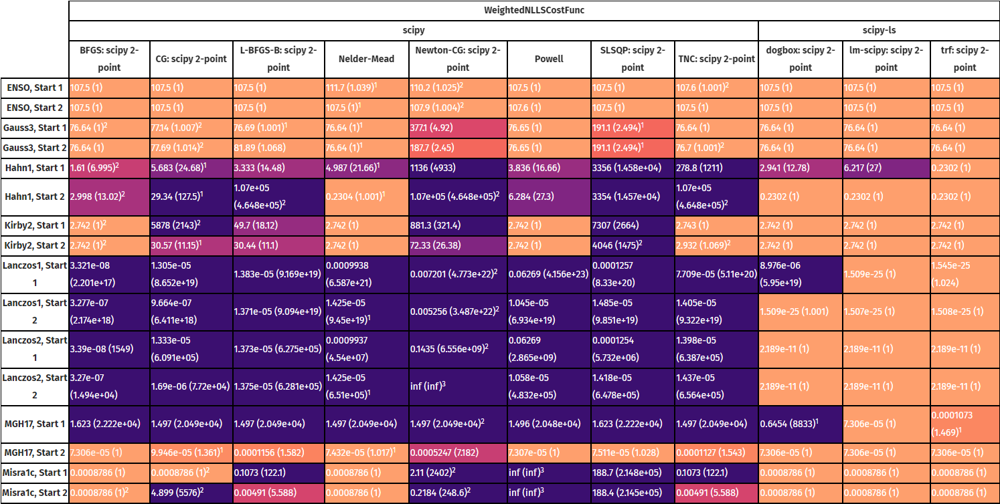
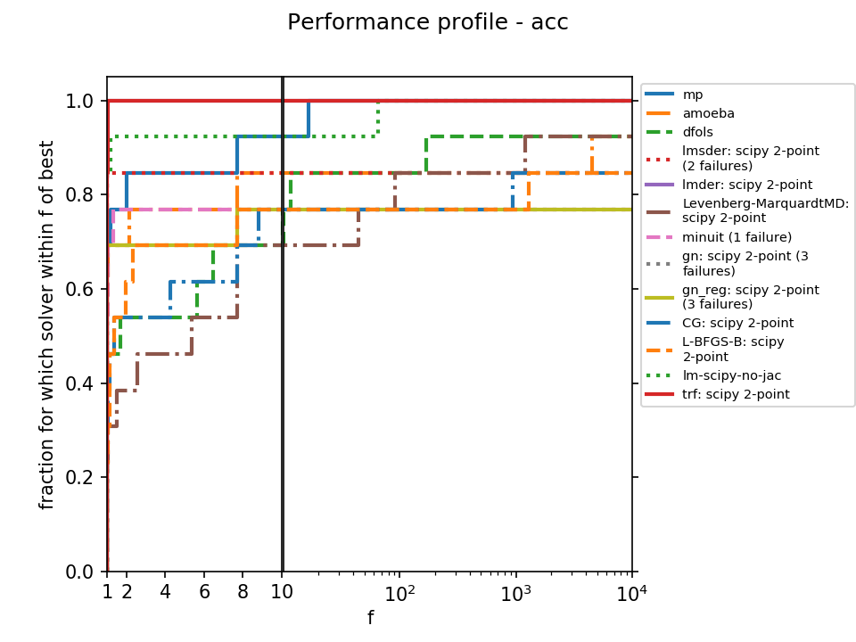

.. _how:

##############################
How does FitBenchmarking work?
##############################

FitBenchmarking takes data and models from real world applications
and data analysis packages.
It fits the data to the models by casting them as a
nonlinear least-squares problem.
We fit the data using a range of data fitting and
nonlinear optimization software, and present comparisons on the
accuracy and timings.

.. figure:: ../../images/FitBenchmarkingConcept.png
   :alt: FitBenchmarking Concept
   :width: 100.0%

*************************
The Benchmarking Paradigm
*************************

FitBenchmarking can compare against any of the supported minmizers listed in
:ref:`minimizer_option`.  We've also made it straightforward to add new software by
following the instructions in :ref:`controllers` -- the software just needs
to be callable from  Python.

Once you have chosen which minimizers you want to compare for a given problem,
running FitBenchmarking will give you a comparison to indicate the
minimizer that performs best.

There are a number of options that you can pick to customize what your tests
are comparing, or how they are run.  A full list of these options, and how to
select them, is given in the section :ref:`options`.

FitBenchmarking creates tables, as given in the section :ref:`output`,
which show a comparison between the different minimizers available.
An example of a table is:

This is the result of FitBenchmarking for a selection of software/minimizers
and different problem definition types supported in FitBenchmarking.
Both the raw chi squared values, and the values normalised with respect
to the best minimizer per problem, are given.
The problem names link to html pages that display plots of the
data and the fit that was performed, together with initial and final
values of the parameters. Here is an example of the final plot fit:

.. figure:: ../../images/example_plot.png
   :alt: Example Plot

Performance Profile
-------------------

With each test FitBenchmarking also produces a Dolan-Moré performance profile:

		  
The solvers appearing in the top left corner may be considered the best
performing on this test set.
See `Dolan and Moré (2001) <https://link.springer.com/article/10.1007/s101070100263>`_
for more information. 

