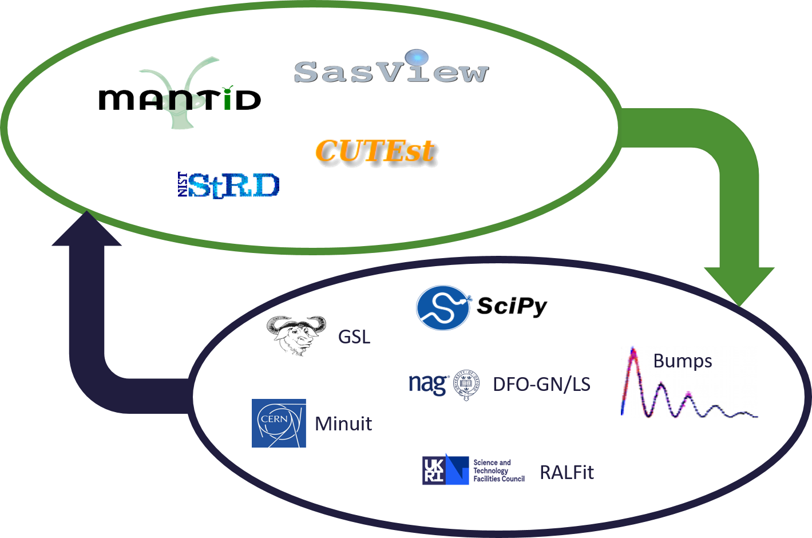

.. _how:

##############################
How does FitBenchmarking work?
##############################

FitBenchmarking takes data and models from real world applications
and data analysis packages.
It fits the data to the models by casting them as a
nonlinear least-squares problem.
We fit the data using a range of data fitting and
nonlinear optimization software, and present comparisons on the
accuracy and timings.

.. toctree::
   :maxdepth: 2
   :titlesonly:
   :caption: FitBenchmarking stages:

   BenchmarkProblems
   BenchmarkingParadigm

