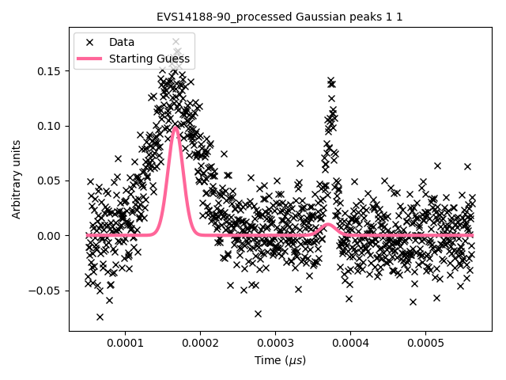
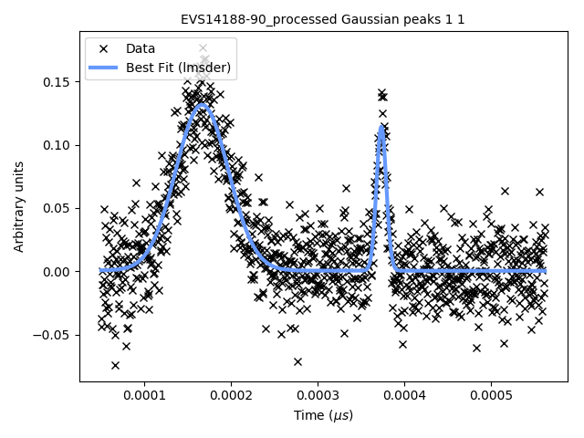

.. _why:

#################################
Why is FitBenchmarking important?
#################################

Fitting a mathematical model to data is a fundamental task across all
scientific disciplines.  (At least) three groups of people have an interest
in fitting software:

-  **Scientists**, who want to know what is the best algorithm for fitting
   their model to data they might encounter, on their specific hardware;

-  **Scientific software developers**, who want to know what is the
   state-of-the-art in fitting algorithms and implementations,
   what they should recommend as their default solver, and if they should
   implement a new method in their software; and

-  **Mathematicians** and **numerical software developers**, who want to understand the
   types of problems on which current algorithms do not perform well,
   and to have a route to expose newly developed methods to users.

Representatives of each of these communities have got together to build FitBenchmarking.
We hope this tool will help foster fruitful interactions and collaborations across the disciplines.

Example workflow
----------------

The black crosses on the plot below are data obtained from an experiment
at the VESUVIO beamline at ISIS Neutron and Muon source:

   VESUVIO experiment data

The scientist needs to interpret this data, and will typically
use a data analysis package to help with this. Such packages are
written by specialist scientific software developers, who are experts in
analysing the kind of data produced by a given experiment;
examples include `Mantid <https://mantidproject.org/>`_,
`SasView <https://www.sasview.org>`_, and `Horace <https://horace.isis.rl.ac.uk>`_.

These packages include mathematical models, which depend on parameters,
that can describe the data.
We need to find values for the parameters in these models which
best fit the data -- for more background, see this `Wikipedia article <https://en.wikipedia.org/wiki/Goodness_of_fit>`_.
The usual way this is done is by finding parameters that minimize the
(weighted) squares of the error in the data, or :math:`\chi^2` value.
This is equivalent to formulating a nonlinear
least-squares problem; specifically, given :math:`n` data points
:math:`(x_i, y_i)` (the crosses in the figure above), together
with estimates of the errors on the values of :math:`y_i`, :math:`\sigma_i`, we solve

.. math:: {\boldsymbol{\beta}}^* = \arg \min_{{\boldsymbol{\beta}}} \underbrace{\sum_i \left( \frac{y_i - f({\boldsymbol{\beta}};x_i)}{\sigma_i} \right)^2}_{\chi^2({\boldsymbol{\beta}})},\label{eq:chi2}

where :math:`f({\boldsymbol{\beta}};x)` is the model we’re trying to
fit, and :math:`\boldsymbol{\beta}` are the parameters we're trying to
find.

Usually the scientist will supply a starting guess,
:math:`{\boldsymbol{\beta}}_0` (the pink curve in the graph above),
which describes where they think the solution might be.
She then has to *choose which algorithm to use to fit the curve*
from the selection available in the analysis software.
Different algorithms may be more or
less suited to a problem, depending on factors such as the architecture
of the machine, the availability of first and second derivatives, the
amount of data, the type of model used, etc.

Below we show the data overlayed by a blue curve, which is a model fitted using the
implementation of the Levenberg-Marquardt algorithm from the GNU Scientific Library (:code:`lmsder`).
The algorithm claims to have found a local minimum with a Chi-squared error of 
0.4771 in 1.9 seconds.

   GSL's :code:`lmsder` (Levenberg-Marquardt) algorithm on the data

We also solved the nonlinear least squares problem using GSL's implementation of
a Nedler-Mead simplex algorithm (:code:`nmsimplex2`), which again claimed to solve
the problem, this time in a faster 1.5 seconds.  However, this time the Chi-squared error was
0.8505, and we plot the curve obtained in green below.  The previous curve
is in dotted-blue, for comparison.
   
.. figure:: ../../images/nmsimplex2_fit_for_EVS14188-90_processed_Gaussian_peaks_1_1.png
   :alt: VESUVIO experiment data: :code:`nmsimplex2`
   :width: 100.0%

   GSL's :code:`nmsimplex2` (Nelder-Mead Simplex) algorithm on the data

By eye it is clear that the solution given by :code:`lmsder` is better.
As the volume of data increases, and we do more and more data analysis
algorithmically, it is increasingly important that we have the best algorithm
without needing to check it by eye.  

FitBenchmarking will help the **scientist** make an informed choice by
comparing runtime and accuracy of all available minimizers, on their
specific hardware, on problems from their science area, which will
ensure they are using the most appropriate minimizer. 

FitBenchmarking will help the **scientific software developer** ensure
that the most robust and quickest algorithms for the type of data
analysis they support are available in their software.

FitBenchmarking will help **mathematicians** see what the state of the
art is, and what kinds of data are problematic.  It will give
them access to real data, and will give a route for novel methods to
quickly make it into production.

A workflow as described above plays a crucial role in the processing and analysis of
data at large research facilities in tasks as diverse as instrument
calibration, refinement of structures, and data analysis methods specific
to different scientific techniques. FitBenchmarking will ensure that, across
all areas that utilise least-squares fitting, scientists can be confident they are
using the best tool for the job.
   
We discuss the specific
FitBenchmarking paradigm in the Section :ref:`how`
