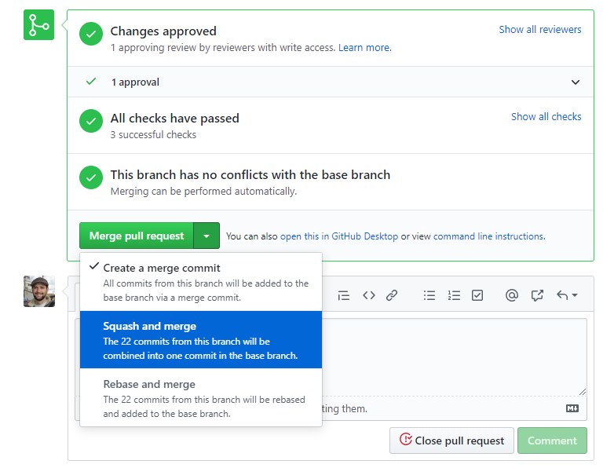

.. _workflow:

############
Git Workflow
############

======
Issues
======

All new work should start with a
`new GitHub issue <https://github.com/fitbenchmarking/fitbenchmarking/issues/new/choose>`_
being filed.
This should clearly explain what the change to the code will do.
There are templates for *Bug report*, *Documentation*,
*Feature request* and *Test* issues on GitHub, and you can also
open a blank issue if none of these work.

If issues help meet a piece of work agreed with our funders, it
is linked to the appropriate `Milestone <https://github.com/fitbenchmarking/fitbenchmarking/milestones>`_ in GitHub.

===============
Adding new code
===============

The first step in adding new code is to create a branch, where the work
will be done. Branches should be named according to the convention
`<nnn>-description_of_work`, where `<nnn>` is the issue number.

Please ensure our :ref:`guidelines` are adhered to throughout
the branch.

When you think your new code is ready to be merged into the codebase,
you should open a pull request to master.
The description should contain the
words `Fixes #<nnn>`, where `<nnn>` is the issue number; this will ensure
the issue is closed when the code is merged into master.  At this point
the automated tests will trigger, and you can see if the code passes on
an independent system.

Sometimes it is desirable to open a pull request when the code is not
quite ready to be merged.  This is a good idea, for example, if you want
to get an early opinion on a coding descision.  If this is the case, you
should mark the pull request as a *draft* on GitHub.

Once the work is ready to be reviewed, you may want to assign a reviewer,
if you think someone would be well suited to review this change.  It is worth
messaging them on, for example, Slack, as well as requesting their review on
GitHub.

================
Release branches
================

Branches named `release-*` are protected branches; code must be approved by
a reviewer before being added to them, and automated tests will be run on
pull requests to these branches.  If code is to be included in the release, it
must be pulled into this branch from master.

Release branches should have the format `release-major.minor.x`, starting from
`release-0.1.x`.  When the code is released, we will tag that commit with
a version number `v0.1.0`.  Any hotfixes will increment `x` by one, and a new tag will
be created accordingly.  If at some point we don't want to provide hot-fixes
to a given minor release, then the corresponding release branch may be deleted.

All changes must be initially merged into master.
There is a `backport-candidate` label, which must be put on pull requests
that in addition must be merged into the release branch.

The recommended mechanism for merging PRs lablelled with `backport-candidate` into
master is to use the `Squash and merge` commit option:

After such a PR (with label `backport-candidate`) has been merged into master, it
must then subsequently be merged into the release branch as soon as possible.
It is the responsibility of the person merging such PRs to also perform this
merge into the release branch.

This can be done using git cherry
pick:

.. code-block:: bash

   git checkout release-x.x.x
   git cherry-pick -x <commit-id>
   git push

If you didn't do a squash merge, you will have to cherry pick each commit in
the PR that this being backported separately.

If you encounter problems with cherry picking into release branch please
don't hesitate to speak to an experienced member of the FitBenchmarking team.

================
Creating a release
================
In order to create a new release for FitBenchmarking, there are a few manual steps.
These have been streamlined as much as possible.

First checkout the branch to create the release from.  Releases should only be made from a `release-x-x` branch, not a development branch or master.

From the root of the repo run the "ci/prep_and_tag_release.sh" script with the new version number.
The version number will be rejected if it is not of the expected form.
We expect a "v" followed by the major, minor, and patch numbers,
and an optional numbered label to mark the type of release.

Possible labels are:
 - -beta (release for testing)
 - -rc (release candidate)

This script will create a new commit with the docs and testing links updated, tag it,
and revert the change in a second commit so that the links point back to the latest versions.

These commits will need to be pushed to github.

Finally, you will need to create a release on github.
This can be done by navigating to the releases page, selecting new release
and typing in the tag that was given to the release
(it should tell you the tag exists at this point!).

For example, For a first beta version of release 0.1.0, one would run:

.. code-block:: bash

   git checkout release-0.1.x
   ci/prep_and_tag_release.sh v0.1.0-beta1
   git push origin release-0.1.x

   <And make the release on GitHub>
