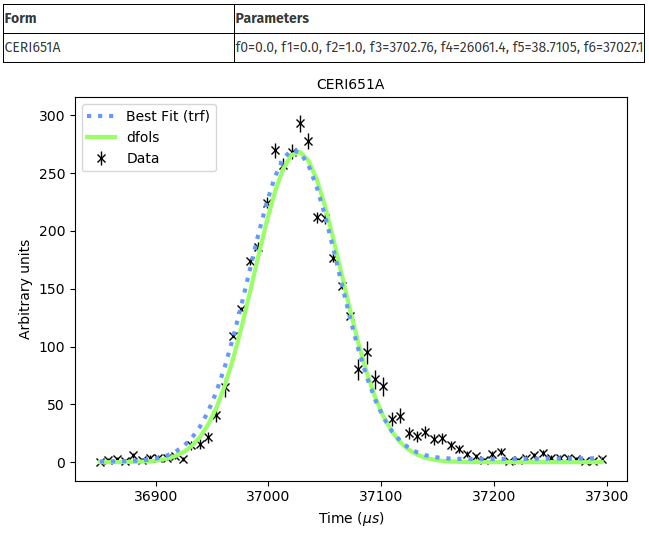

.. FitBenchmarking documentation master file, created by
   sphinx-quickstart on Wed Sep 11 09:17:28 2019.
   You can adapt this file completely to your liking, but it should at least
   contain the root `toctree` directive.

###########################################
Welcome to FitBenchmarking's documentation!
###########################################

.. toctree::
   :titlesonly:

   Users <users/index>
   Contributors <contributors/index>

FitBenchmarking is an open source tool for comparing different
minimizers/fitting frameworks based on their accuracy and runtimes.

FitBenchmarking is cross platform and should install and run on Windows,
Linux and Mac OS. As of this writing the tool does not have instructions
and/or code for setting it up to run on specialised hardware.

For questions, requests etc. don’t hesitate to contact us on
fitbenchmarking.supp@gmail.com.

Content on this wiki
--------------------

Almost all content on this wiki is for developers with the exception of
the Getting Started page.

What the tool does
------------------

The tool creates a table/tables that shows a comparison between the
different minimizers available in a fitting software (e.g. scipy or
mantid), based on their accuracy and/or runtimes. An example of a table
is:

.. figure:: ../images/example_table.png
   :alt: Example Table

This is the result of fitbenchmarking mantid on a set of neutron data.
The results are chi squared values as well as a normalised value with respect
to the best minimizer per problem.
The problem names link to html pages that display plots of the
data and the fit that was performed, together with initial and final
values of the parameters. Here is an example of the final plot fit.

Currently Benchmarking
----------------------

.. image:: https://avatars0.githubusercontent.com/u/671496?s=400&v=4
   :alt: Mantid
   :height: 100px
   :target: http://www.mantidproject.org/Main_Page

.. image:: http://gracca.github.io/images/python-scipy.png
   :alt: SciPy
   :height: 100px
   :target: https://www.scipy.org/

