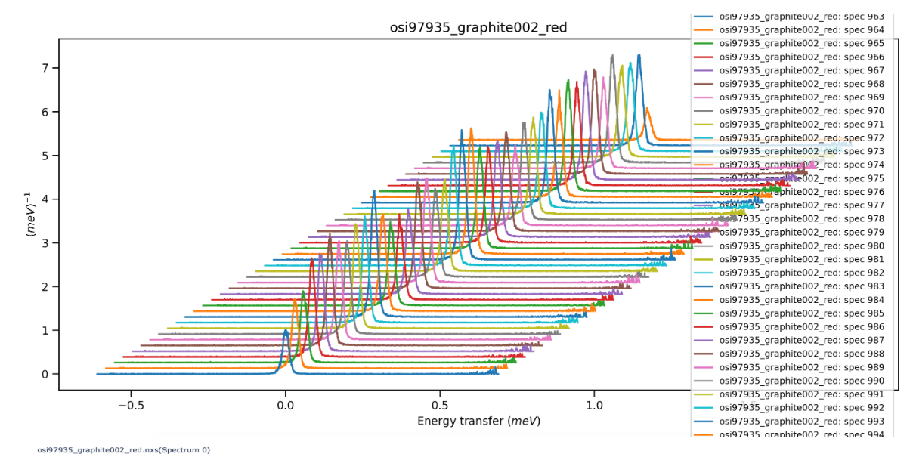

.. _BenchmarkProblems:

====================
 Benchmark problems
====================

To help choose between the different minimizers, we have made some curated
problems available to use with FitBenchmarking.  It is also straightforward to
add custom data sets to the benchmark, if that is more appropriate; see
:ref:`problem_def` for specifics of how to add additional problems in a
supported file format.

.. topic:: Downloads

    **You can download a folder containing all examples here:**
    :download:`.zip <https://fitbenchmarking.github.io/assets/datasets/examples.zip>`
    or :download:`.tar.gz <https://fitbenchmarking.github.io/assets/datasets/examples.tar.gz>`

    Individual problem sets are also available to download below.

We supply some standard nonlinear least-squares test problems in the
form of the `NIST nonlinear regression set <https://www.itl.nist.gov/div898/strd/nls/nls_main.shtml>`_
and the relevant problems from the `CUTEst problem set <https://github.com/ralna/CUTEst/wiki>`_,
together with some real-world 
data sets that have been extracted from `Mantid <https://www.mantidproject.org>`__ and
`SASView <https://www.sasview.org>`__ usage examples and system tests.
We've made it possible to extend this list by following the steps in 
:ref:`parsers`.

Each of the test problems contain:

* a data set consisting of points :math:`(x_i, y_i)` (with optional errors on :math:`y_i`, :math:`\sigma_i`);
* a definition of the fitting function, :math:`f({\boldsymbol{\beta}};x)`; and
* (at least) one set of initial values for the function parameters :math:`{\boldsymbol{\beta}}_0`.
  
If a problem doesn't have observational
errors (e.g., the NIST problem set), then FitBenchmarking can
approximate errors by taking :math:`\sigma_i = \sqrt{y_i}`.
Alternatively, there is an option to disregard errors and solve the
unweighted nonlinear least-squares problem, setting
:math:`\sigma_i = 1.0` irrespective of what has been passed in with the
problem data.

As we work with scientists in other areas, we will extend the problem
suite to encompass new categories. The FitBenchmarking framework has
been designed to make it easy to integrate new problem sets, and any
additional data added to the framework can be tested with any and all of
the available fitting methods.

Currently FitBenchmarking ships with data from the following sources:

CrystalField Data (Mantid)
==========================

**Download** :download:`.zip <https://fitbenchmarking.github.io/assets/datasets/CrystalField.zip>`
or :download:`.tar.gz <https://fitbenchmarking.github.io/assets/datasets/CrystalField.tar.gz>`

This folder (also found in `examples/benchmark_problems/CrystalField`) contains
a test set for inelastic neutron scattering measurements of transitions between
crystal field energy levels.

This problem has 8 parameters, and fits around 200 data points. 

.. warning::
    |MantidWarning|

CUTEst (NIST files)
===================

**Download** :download:`.zip <https://fitbenchmarking.github.io/assets/datasets/CUTEst.zip>`
or :download:`.tar.gz <https://fitbenchmarking.github.io/assets/datasets/CUTEst.tar.gz>`

This folder (also found in `examples/benchmark_problems/CUTEst`) contains
several problems from the `CUTEst <https://github.com/ralna/CUTEst>`_
continuous optimization testing environment which have been converted to the NIST
format.

These problems all have 8 unknown parameters, and fit around 15 data points
with the exception of ``VESUVIOLS`` which fits around 1000.

Data Assimilation
=================

**Download** :download:`.zip <https://fitbenchmarking.github.io/assets/datasets/Data_Assimilation.zip>`
or :download:`.tar.gz <https://fitbenchmarking.github.io/assets/datasets/Data_Assimilation.tar.gz>`

This folder (also found in `examples/benchmark_problems/Data_Assimilation`) contains
two examples using the data assimilation problem definition in fitbenchmarking.
These examples follow the method set out in 
`this paper <https://www.researchgate.net/publication/324956488_Data_assimilation_approach_to_analysing_systems_of_ordinary_differential_equations>`_.

These data files are synthetic and have been generated as an initial test of
the minimizers. We plan to extend this with time series data which is more
representative of the expectations for data assimilation in future updates.

These problems have either 2 or 3 unknown parameters, and fit either 100 or
1000 data points for ``Simplified ANAC`` and ``Lorentz`` problems respectively.

Powder Diffraction Data (SIF files)
===================================

**Download** :download:`.zip <https://fitbenchmarking.github.io/assets/datasets/DIAMOND_SIF.zip>`
or :download:`.tar.gz <https://fitbenchmarking.github.io/assets/datasets/DIAMOND_SIF.tar.gz>`

These problems (also found in the folder `examples/benchmark_problems/DIAMOND_SIF`)
contain data from powder diffraction experiments.  The data supplied comes
from the `I14 Hard X-Ray Nanoprobe <https://www.diamond.ac.uk/Instruments/Imaging-and-Microscopy/I14.html>`_ beamline at
the Diamond Light source, and has been supplied in the SIF
format used by `CUTEst <https://github.com/ralna/CUTEst>`_.

These problems have either 66 or 99 unknown parameters, and fit around 5,000 data points.

.. warning::
    |CUTEstWarning|

   
MultiFit Data (Mantid)
======================

**Download** :download:`.zip <https://fitbenchmarking.github.io/assets/datasets/MultiFit.zip>`
or :download:`.tar.gz <https://fitbenchmarking.github.io/assets/datasets/MultiFit.tar.gz>`

These problems (also found in the folder `examples/benchmark_problems/MultiFit`)
contain data
for testing the MultiFit functionality of Mantid.  This contains
a simple data set, on which two fits are done, and a calibration
dataset from the `MuSR <https://www.isis.stfc.ac.uk/Pages/musr.aspx>`_
spectrometer at ISIS, on which there are four fits available.
See :ref:`The MultiFit documentation<multifit>` for more details.

Basic Multifit has 3 unknown parameters, and fits 40 data points.
MUSR62260 has 18 unknown parameters, and fits around 8000 data points.

.. warning::
    |MantidWarning|
   
    This will also only work using the :ref:`mantid` minimizers.

Muon Data (Mantid)
==================

**Download** :download:`.zip <https://fitbenchmarking.github.io/assets/datasets/Muon.zip>`
or :download:`.tar.gz <https://fitbenchmarking.github.io/assets/datasets/Muon.tar.gz>`

These problems (also found in the folder `examples/benchmark_problems/Muon`)
contain data from Muon spectrometers.  The data supplied comes
from the `HiFi <https://www.isis.stfc.ac.uk/Pages/hifi.aspx>`_ and 
`EMU <https://www.isis.stfc.ac.uk/Pages/EMU.aspx>`_ instruments at
STFC's ISIS Neutron and Muon source, and has been supplied in the
format that `Mantid <https://mantidproject.org/>`__ uses to process
the data.

These problems have between 5 and 13 unknown parameters, and fit around 1,000 data points.

.. warning::
    |MantidWarning|

Neutron Data (Mantid)
=====================

**Download** :download:`.zip <https://fitbenchmarking.github.io/assets/datasets/Neutron.zip>`
or :download:`.tar.gz <https://fitbenchmarking.github.io/assets/datasets/Neutron.tar.gz>`

These problems (also found in the folder `examples/benchmark_problems/Neutron`)
contain
data from Neutron scattering experiments.  The data supplied comes
from the `Engin-X <https://www.isis.stfc.ac.uk/Pages/Engin-X.aspx>`_,
`GEM <https://www.isis.stfc.ac.uk/Pages/gem.aspx>`_,
`eVS <https://www.isis.stfc.ac.uk/Pages/Vesuvio.aspx>`_, and
`WISH <https://www.isis.stfc.ac.uk/Pages/wish.aspx>`_ instruments at
STFC's ISIS Neutron and Muon source, and has been supplied in the
format that `Mantid <https://mantidproject.org/>`__ uses to process
the data.

The size of these problems differ massively.
The Engin-X calibration problems find 7 unknown parameters, and fit to
56-67 data points.
The Engin-X vanadium problems find 4 unknown parameters, and fit to around 14,168
data points.
The eVS problems find 8 unknown parameters, and fit to 1,025 data points.
The GEM problem finds 105 unknown parameters, and fits to 1,314 data points.
The WISH problems find 5 unknown parameters, and fit to 512 data points.

.. warning::
    |MantidWarning|

NIST
====

**Download** :download:`.zip <https://fitbenchmarking.github.io/assets/datasets/NIST.zip>`
or :download:`.tar.gz <https://fitbenchmarking.github.io/assets/datasets/NIST.tar.gz>`

These problems (also found in the folder `examples/benchmark_problems/NIST`) contain
data from the `NIST Nonlinear Regression <https://www.itl.nist.gov/div898/strd/nls/nls_main.shtml>`_ test set.

These problems are split into low, average and high difficulty.
They have between 2 and 9 unknown parameters, and
fit between 6 and 250 data points.

Poisson Data
============

**Download** :download:`.zip <https://fitbenchmarking.github.io/assets/datasets/Poisson.zip>`
or :download:`.tar.gz <https://fitbenchmarking.github.io/assets/datasets/Poisson.tar.gz>`

These problems (also found in the folder `examples/benchmark_problems/Poisson`) contain
both simulated and real data measuring particle counts. The real data is ISIS
muon data, and the simulated datasets have been made to represent counts using
models provided by both Mantid and Bumps.

These problems have between 4 and 6 unknown parameters, and around 350, 800,
and 2000 data points for simulated bumps, HIFI_160973, and simulated mantid
respectively.

.. warning::
    |MantidWarning|

Small Angle Scattering (SASView)
================================

**Download** :download:`.zip <https://fitbenchmarking.github.io/assets/datasets/SAS_modelling.zip>`
or :download:`.tar.gz <https://fitbenchmarking.github.io/assets/datasets/SAS_modelling.tar.gz>`

These problems (also found in the folder `examples/benchmark_problems/SAS_modelling/1D`) are
two data sets from small angle scattering experiments.
These are from fitting data to a
`cylinder <https://www.sasview.org/docs/user/models/cylinder.html>`_,
and have been supplied in the format that `SASView <https://www.sasview.org>`__
uses to process the data.

These have 6 unknown parameters, and fit to either 20 or 54 data points.

.. warning::
    The external package ``sasmodels`` must be installed to run this data
    set.  See :ref:`external-instructions` for details.

CUTEst (SIF files)
==================

**Download** :download:`.zip <https://fitbenchmarking.github.io/assets/datasets/SIF.zip>`
or :download:`.tar.gz <https://fitbenchmarking.github.io/assets/datasets/SIF.tar.gz>`

This directory (also found in the folder `examples/benchmark_problems/SIF`) contain
`SIF files <https://github.com/ralna/SIFDecode>`_
encoding least squares problems 
from the `CUTEst <https://github.com/ralna/CUTEst>`_
continuous optimization testing environment.

These are from a wide range of applications.  They have between
2 and 9 unknown parameters, and for the most part fit between
6 and 250 data points, although the `VESUVIO` examples (from
the `VESUVIO <https://www.isis.stfc.ac.uk/Pages/Vesuvio.aspx>`_
instrument at ISIS) have 1,025 data points (with 8 unknown parameters).

.. warning::
    |CUTEstWarning|

SIF_GO
======

**Download** :download:`.zip <https://fitbenchmarking.github.io/assets/datasets/SIF_GO.zip>`
or :download:`.tar.gz <https://fitbenchmarking.github.io/assets/datasets/SIF_GO.tar.gz>`

This directory (also found in the folder `examples/benchmark_problems/SIF_GO`) contains
`SIF files <https://github.com/ralna/SIFDecode>`_
encoding least squares problems 
from the `CUTEst <https://github.com/ralna/CUTEst>`_
continuous optimization testing environment.

All of these problems have been modified, with finite bounds added for all parameters,
making the problems appropriate for testing global optimization solvers. The bounds that
have been added to each problem are the same as those used in SciPy's
`global optimization benchmark functions <https://github.com/scipy/scipy/tree/master/benchmarks/benchmarks/go_benchmark_functions>`_.

These problems have between 3 and 7 unknown parameters, and fit between 9 and 37 data points.

.. warning::
    |CUTEstWarning|

HOGBEN Samples
==============

**Download** :download:`.zip <https://fitbenchmarking.github.io/assets/datasets/HOGBEN_samples.zip>`
or :download:`.tar.gz <https://fitbenchmarking.github.io/assets/datasets/HOGBEN_samples.tar.gz>`

These problems (also found in the folder `examples/benchmark_problems/HOGBEN_samples`)
contain simulated reflectometry data. The data supplied has been generated using the
`HOGBEN sample suite <https://github.com/jfkcooper/HOGBEN/blob/main/hogben/models/samples.py>`_.

These problems have between 4 and 10 unknown parameters, and fit around 180 data points.

Bundle Adjustment in the Large (BAL)
====================================

**Download** :download:`.zip <https://fitbenchmarking.github.io/assets/datasets/Bundle_Adjustment.zip>`
or :download:`.tar.gz <https://fitbenchmarking.github.io/assets/datasets/Bundle_Adjustment.tar.gz>`

These problems (also found in the folder `examples/benchmark_problems/Bundle_Adjustment`)
contain image data, either captured at a regular rate using a Ladybug camera, or downloaded
from Flickr.com. Please see the `GRAIL <https://grail.cs.washington.edu/projects/bal/>`_
webpage for more information on these datasets.

These problems have between ~20,000 and ~190,000 unknown parameters, and fit between ~60,000 and ~170,000 data points.

.. note::
    These problems can currently only be run using the `scipy_ls` software, which supports sparse jacobians.
    When running these problems with the `nlls` cost function, we would suggest adding the options
    `ftol=1e-4` and `x_scale='jac'` to the call to `scipy.optimize.least_squares`.

Simple tests
============

**Download** :download:`.zip <https://fitbenchmarking.github.io/assets/datasets/simple_tests.zip>`
or :download:`.tar.gz <https://fitbenchmarking.github.io/assets/datasets/simple_tests.tar.gz>`

This folder (also found in `examples/benchmark_problems/simple_tests`) contains
a number of simple tests with known, and easy to obtain,
answers.  We recommend that this is used to test any new minimizers
that are added, and also that any new parsers reimplement these
data sets and models (if possible).

These problems have 3 or 4 unknown parameters, and around 100 data points.

.. |CUTEstWarning| replace::
    The external packages CUTEst and pycutest must be installed to run
    this data set.   See :ref:`external-instructions` for details.

.. |MantidWarning| replace::
    The external package Mantid must be installed to run
    this data set.  See :ref:`external-instructions` for details.

Mantid System Test Data
=======================

**Download** :download:`.zip <https://fitbenchmarking.github.io/assets/datasets/Mantid_System_Test_Data.zip>`
or :download:`.tar.gz <https://fitbenchmarking.github.io/assets/datasets/Mantid_System_Test_Data.tar.gz>`

This folder (found in `examples/benchmark_problems/Mantid_System_Test_Data`)
contains data from the Mantid System Tests. The data was taken from the 
`OSIRISIqtAndIqtFit <https://github.com/mantidproject/mantid/blob/48e9b01fb09802db0d4cfaff94dc265a875a1846/Testing/SystemTests/tests/framework/ISISIndirectInelastic.py#L871>`_ test.
The spectrums come from `osi97935_graphite002_red.nxs` and is used in ISIS indirect inelastic calibration tests.

Synthetic Datasets
==================

**Download** :download:`.zip <https://fitbenchmarking.github.io/assets/datasets/synthetic_data.zip>`
or :download:`.tar.gz <https://fitbenchmarking.github.io/assets/datasets/synthetic_data.tar.gz>`

This folder (found in `examples/benchmark_problems/synthetic_data`) contains
synthetic data to test the minimizers of Mantid. The data was generated to
particularly test the **BackToBackExponential** and the **Gaussian** fitting
functions.

The data for testing the `BackToBackExponential` fitting can be found within
the `backtobackexp` subfolder. It contains a dataset with 15 different starting 
conditions for the parameters. 

The data for testing the `Gaussian` fitting can be found within
the `gaussian` subfolder. It contains a dataset with 16 different starting 
conditions for the parameters. 

SpinW 2D Powder Data
====================

**Download** :download:`.zip <https://fitbenchmarking.github.io/assets/datasets/spinw_powder_data.zip>`
or :download:`.tar.gz <https://fitbenchmarking.github.io/assets/datasets/spinw_powder_data.tar.gz>`

This problem (also found in the folder `examples/benchmark_problems/SpinW_powder_data`)
contains 1D cuts of 2D powder data simulated using SpinW, using the approach outlined
in `this tutorial <https://spinw.org/tutorials/39tutorial>`_ .

This problem has 8 unknown parameters and 186 data points.