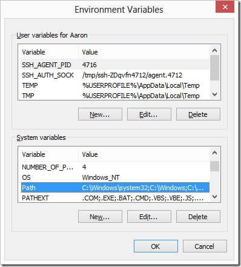
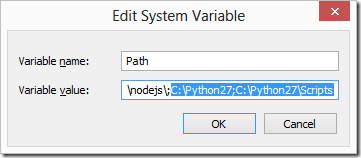

.. _getting-started:

###############
Getting Started
###############

|Python 2.7| will be needed for running/installing this. For instructions
on setting up python see :ref:`setting-up-python`.

1. Download this repository or clone it using
   `git <https://git-scm.com/>`__:
   ``git clone https://github.com/mantidproject/fitbenchmarking.git``
2. Open up a terminal (command prompt) and go into the
   ``fitbenchmarking`` directory.
3. Once you are in the right directory, type
   ``python setup.py install``.
4. Install mantid, for platform specific instructions see :ref:`setting-up-mantid`.
5. Finally run ``fitbenchmarking/example_scripts/example_runScript.py``,
   located in the example\_scripts folder. This example script fit
   benchmarks Mantid using all the available minimizers. The result
   tables can be found in ``example_scripts/results``.

.. |Python 2.7| image:: https://img.shields.io/badge/python-2.7-blue.svg
   :target: https://www.python.org/downloads/release/python-2715/

.. _setting-up-python:

******************
Setting up Python
******************

Windows
=======

Download and Install Python
---------------------------

Download python 2.7
`here <https://www.python.org/downloads/release/python-2715/>`__. From
the list at the bottom of the page, please select
``Windows x86 MSI installer``. Double click and run the installer with
the default options.

Add the Python 2.7 Directory to your Path Environment Variable
--------------------------------------------------------------

In order to make it so you can access Python via any command line prompt
(and not just the Python-specific one), you’ll need to add the
newly-installed Python 2.7 directory to your “Path” system environment
variable. This makes it easier to access Python and run scripts in
whatever shell you’re using to using (Command Prompt, PowerShell or Git
Bash.) Go to Control Panel –> System Properties –> Environment Variables
and select the PATH variable from the list below:

   Path Variable List

Click **edit** and append the Python path at the end of the string like
so:

   Appending Python Path

Also make sure you include the
``C:\Python27\Scripts`` in the Path too even
if it doesn’t exist yet – this is where your package management tools,
unit testing tools, and other command line-accessible Python programs
will live.

Installing pip
--------------

There’s a couple of different options for package management in Python,
here we are going to use pip. Pip makes it trivial for us to install
Python packages, like ``setuptools``. You are going to have to install
packages pretty often if we’re working with third party tools and
libraries, so this is a must-have.

`Pip has a detailed set of instructions on how to install it from
source <https://pip.pypa.io/en/latest/installing/>`__ – if you don’t
have the curl command on your system, just use your Git or even your web
browser to download the source file mentioned in their instructions.

Installing setuptools
---------------------

Installing setuptools, which will be needed for installing the
fitbenchmarking package, is straight forward. If pip installed
succesfully, just run: ``pip install setuptools``

This concludes the python installation guide for Windows 7/10.

Linux
=====

Python comes with the supported versions of Ubuntu (18.04 or 16.04).

Setting up Pip and Setuptools
-----------------------------

It also usually has pip installed. If pip is not present in your system,
please open a terminal and run ``sudo apt-get install python-pip``
Following this, to get the setuptools package run
``sudo pip install python-setuptools``

This concludes the python installation guide for Ubuntu 16.04/18.04.

.. _setting-up-mantid:

*****************
Installing Mantid
*****************

Windows
=======

The fitbenchmarking setup does not currently support installing mantid
through it. Mantid can be downloaded from
`here <http://download.mantidproject.org/>`__. From the `Mantid
installation instructions
page <http://download.mantidproject.org/windows.html>`__:

The steps below will guide you through installation of Mantid on
Windows:

1. Find the version of Mantid you previously downloaded. By default, it
   will automatically download to your downloads folder, which is
   located at: ``C:\Users\$USER\Downloads`` where
   ``$USER`` is your Windows username.
2. Double click the installer and click **Run**.
3. Go through the steps of the installer. The default settings are
   recommended.
4. Once you click **Install** the installation process will begin, and
   inform you when it is complete.
5. That’s it! Once the installation process is complete a MantidPlot
   icon will appear on your desktop, and in your start menu.

**Note**: the installer will look for the drive with the most free disk
space, which may include external devices. Installing and uninstalling
on these devices is extremely slow, and not recommended.

Linux
=====

Installing Through the FitBenchmarking Tool
-------------------------------------------

The fitbenchmarking tool does support installing mantid through it on
Ubuntu 16.04 and Ubuntu 18.04. Open up a terminal and cd into the
fitbenchmarking folder. Here, type ``python setup.py help`` and follow
the instrucitons there to install mantid or any additional external
software. For clarity, it is as simple as running
``python setup.py externals -s mantid``

Manual Installation - Terminal
------------------------------

If for some reason this does not work for you, a manual installation
might instead. From the `Mantid installation instructions
page <http://download.mantidproject.org/ubuntu.html>`__

   1. Open up a terminal
   2. Run the following commands one line at a time:

::

   # add the mantid signing key
   wget -O - http://apt.isis.rl.ac.uk/2E10C193726B7213.asc | sudo apt-key add -
   sudo apt-add-repository "deb [arch=amd64] http://apt.isis.rl.ac.uk $(lsb_release -c | cut -f 2) main"
   sudo apt-add-repository ppa:mantid/mantid

3. Install the package with

::

   sudo apt-get update
   sudo apt-get install mantid

This will install Mantid into ``/opt/Mantid`` and add bash files to
``/etc/profile.d`` so that next time you create a terminal the correct path
to MantidPlot will be defined.

Manual Installation - Package
-----------------------------

To download the package manually go
`here <http://download.mantidproject.org/>`__. To install a package
manually, first install gdebi: ``sudo apt-get install gdebi`` then
install mantid using: ``sudo gdebi pkgname.deb`` while you are in the
folder from where you downloaded mantid and replace pckgname with the
name of the downloaded file.

.. _setting-up-ralfit:

*****************
Installing RAlfit
*****************

The fitbenchmarking setup does not currently support installing RALfit
through it. RALfit can be downloaded and installed from
`here https://github.com/ralna/RALFit>`__.
