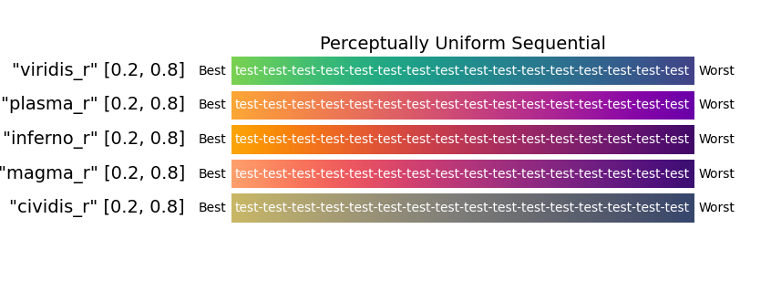
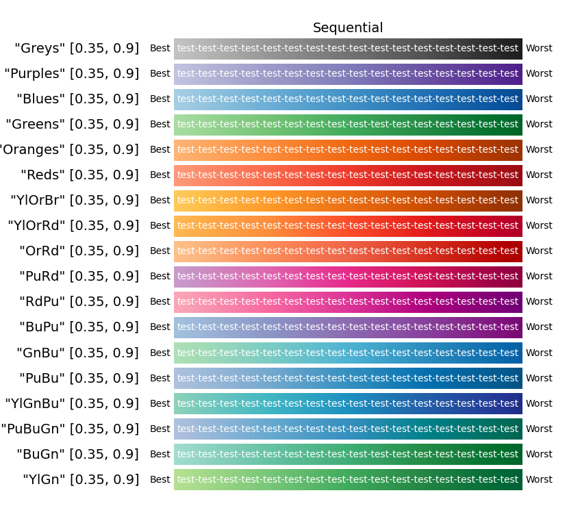
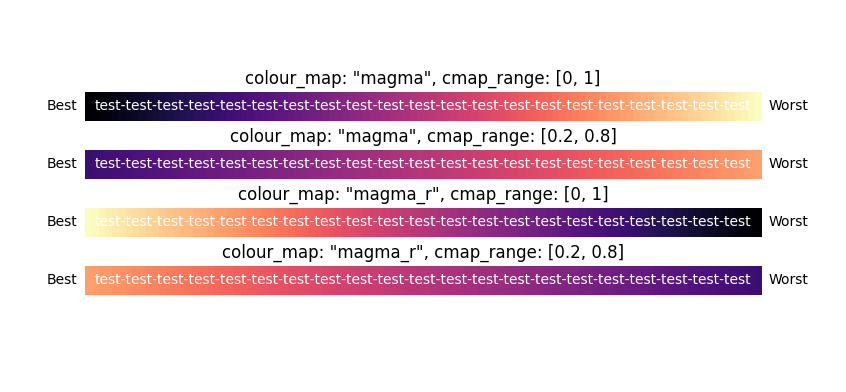

.. _output_option:

################
Output Options
################

The output section contains options to control how results are outputted and presented.

.. _results_directory_option:

Results directory (:code:`results_dir`)
---------------------------------------

This is used to select where the output should be saved. If the 
:ref:`results directory command line argument <change_results_directory>` 
is provided, this option is overridden.

Default is ``fitbenchmarking_results``

.. code-block:: rst

    [OUTPUT]
    results_dir: fitbenchmarking_results

.. _MakePlots:

Make plots (:code:`make_plots`)
-------------------------------

This allows the user to decide whether or not to create plots during runtime.
Toggling this to False will be much faster on large data sets.

Default is ``True`` (``yes``/``no`` can also be used)

.. code-block:: rst

    [OUTPUT]
    make_plots: yes

Colourmap (:code:`colour_map`)
------------------------------
Specifies the name of the colourmap the user wishes to use, e.g. ``magma``, ``viridis``, ``OrRd``. Options are:

* Any colourmap from the library in ``matplotlib``, see the complete library `here <https://matplotlib.org/stable/gallery/color/colormap_reference.html>`_.
* Appending ``_r`` to the end of the name will reverse the colourmap.
* The following sequential colourmaps are recommended:

Default colourmap is ``magma_r``

.. code-block:: rst

    [OUTPUT]
    colour_map: magma_r

Colourmap Range (:code:`cmap_range`)
------------------------------------
A two-element list used to specify the lower and upper limit of the chosen colourmap. Options are:

* ``[lower_limit, upper_limit]`` where limits consider the full colourscale limits to be 0 and 1, so any pair of values must fall within this range.

* Limits should be introduced to make the **white text** readable, see the following example.

Default for ``magma`` is ``[0.2, 0.8]`` (suitability depends on colourmap)

.. code-block:: rst

    [OUTPUT]
    colour_map: magma_r
    cmap_range: [0.2, 0.8] 

Colour Upper Limit (:code:`colour_ulim`)
----------------------------------------

Controls how relatively poorly a minimizer has to perform in order to receive the `worst` colour. For example,
a value of 100 would mean that any performance greater than or equal to 100 times worse than the best
minimizer would receive the worst colour. This ensures that colour scale is not compromised by especially 
poor relative results. Options are:

* Any float between ``1`` and ``np.inf``
* Recommended value ``100``

Default is ``100``

.. code-block:: rst

    [OUTPUT]
    colour_map: magma_r
    cmap_range: [0.2, 0.8] 
    colour_ulim: 100

.. _ComparisonOption:

Comparison mode (:code:`comparison_mode`)
-----------------------------------------

This selects the mode for displaying values in the resulting table
options are ``abs``, ``rel``, ``both``:

* ``abs`` indicates that the absolute values should be displayed
* ``rel`` indicates that the values should all be relative to the best result
* ``both`` will show data in the form "abs (rel)"

Default is ``both``

.. code-block:: rst

    [OUTPUT]
    comparison_mode: both

Table type (:code:`table_type`)
-------------------------------

This selects the types of tables to be produced in FitBenchmarking.
Options are:

* ``acc`` indicates that the resulting table should contain the chi squared values for each of the minimizers.
* ``runtime`` indicates that the resulting table should contain the runtime values for each of the minimizers.
* ``compare`` indicates that the resulting table should contain both the chi squared value and runtime value for each of the minimizers. The tables produced have the chi squared values on the top line of the cell and the runtime on the bottom line of the cell.
* ``local_min`` indicates that the resulting table should return true if a local minimum was found, or false otherwise.
  The value of :math:`\frac{|| J^T r||}{||r||}` for those parameters is also returned.
  The output looks like ``{bool} (norm_value)``, and the colouring is red for false and cream for true.
  This option is only meaningful for least-squares cost functions.

Default is ``acc``, ``runtime``, ``compare``, and ``local_min``.

.. code-block:: rst

    [OUTPUT]
    table_type: acc
                runtime
                compare
                local_min
