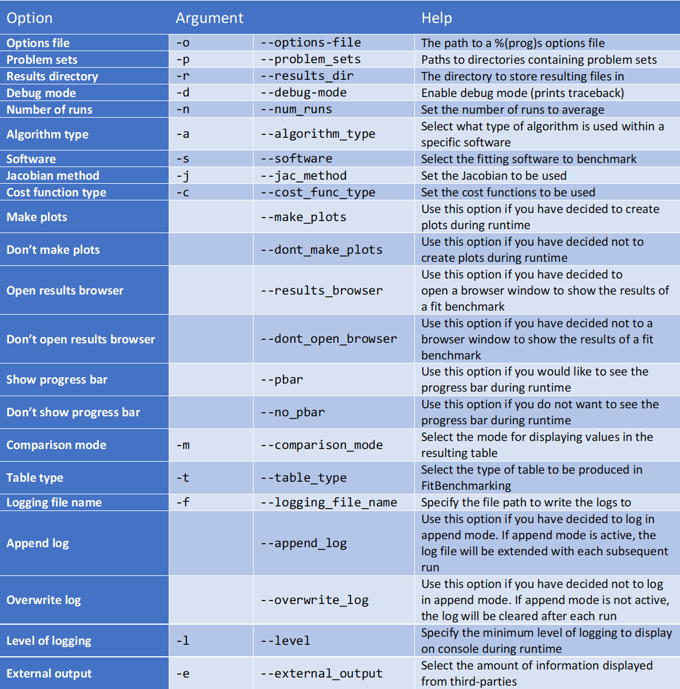

.. _running:

#######################
Running FitBenchmarking
#######################

Once installed, issuing the command

.. code-block:: bash

   fitbenchmarking

will run the NIST average difficulty problem set on SciPy minmizers.

Running alternative problems
----------------------------

Other problems written in a :ref:`supported file format <problem_def>`
can be analyzed with FitBenchmarking by
passing the path using the ``-p`` or ``--problem-sets`` argument.
Example problems can be downloaded from
:ref:`BenchmarkProblems`, and they can also be found in the
``fitbenchmarking/examples`` directory of the code.

For example, to run the NIST low difficulty set from the base directory
of the source, type into the terminal:

.. code-block:: bash
		
   fitbenchmarking -p examples/benchmark_problems/NIST/low_difficulty

Changing the options
--------------------
   
An options file can also be passed with the ``-o`` or ``--options-file`` argument. 
For example, the template file can be run by issuing the command

.. code-block:: bash

   fitbenchmarking -o examples/options_template.ini \
   -p examples/benchmark_problems/NIST/low_difficulty

Details about how the options file must be formatted are given in :ref:`options`.

.. _change_results_directory:

Changing options via the command line
------------------------------

It is possible to change the following options via the command line rather than from an ``.ini`` file or from the default options.
They can be changed using the arguments in the table below.

**For example, to change the results directory:**

The default directory where the results are saved can be changed using the ``-r``
or ``--results-dir`` argument. The :ref:`results directory option <results_directory_option>`
can also be changed in the options file.

.. code-block:: bash

   fitbenchmarking -r new_results/

The default results directory is ``fitbenchmarking_results``.

**Multiple options**

For an option for which you wish to make several choices e.g. ``table_type``, simply use a space to separate your choices:

.. code-block:: bash

   fitbenchmarking -t acc runtime

If you wish to change several different options, use a space to separate the arguments:

.. code-block:: bash

   fitbenchmarking -t acc -l WARNING

**Help**

For more information on changing options via the command line, you can use the ``-h``
or ``--help`` argument.

.. code-block:: bash

   fitbenchmarking -h
