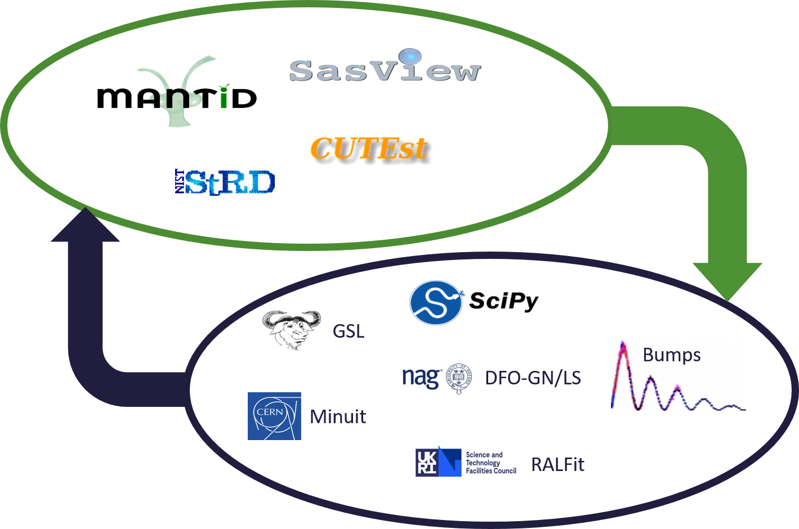

# Summary

Fitting a mathematical model to data is a fundamental task across all scientific disciplines. [`FitBenchmarking`](https://fitbenchmarking.com/) has been designed to help:

* Scientists, who want to know the best algorithm for fitting their data to a given model using specific hardware.
* Scientific software developers, who want to identify the best fitting algorithms and implementations. This allows them to recommend a default solver, to see if it is worth adding a new minimizer, and to test their implementation.
* Mathematicians and numerical software developers, who want to understand the types of problems on which current algorithms do not perform well, and to have a route to expose newly developed methods to users.

Representatives of each of these communities have got together to build `FitBenchmarking`. We hope this tool will help foster fruitful interactions and collaborations across the disciplines.

{width=60%}

`FitBenchmarking` is easy to install via `pip` and our [documentation](https://fitbenchmarking.com/) guides users through the installation of some external packages we support. We provide several data sets from a range of applications and adding new data in these formats is as easy as dropping the data into a new folder. The data and fitting packages currently supported are shown in Figure \ref{fig:concept}. A key part of `FitBenchmarking` is the ease of which a user, with a basic knowledge of `Python`, can add new fitting software, data formats and different fitting comparison output metrics.

# State of the field

Fitting data to models is a form of optimization, and 
`CUTEst` [@cutest], and its predecessors, has been the standard tool to
benchmark optimization packages for some time. `CUTEst` can benchmark any problem
written in a custom `SIF` format.  However, only the hooks to run the same problem are
provided, the user must provide their own data analysis.  Tools such as
`Paver` [@paver], part of the COIN-OR initiative, can be used
alongside `CUTEst` (or other tools) for this purpose.
The packages `Olympus` [@olympus] and `Benchopt` [@benchopt] have been recently
developed as benchmarking and analysis frameworks for optimization problems.
`Olympus` is designed for experiment planning and provides analytic benchmark problems,
experimental datasets, and emulated datasets, but could be adapted to be applied to
any optimization (or data-fitting) problem.
`Benchopt`, on the other hand, is currently primarily used to benchmark data fitting
using a range of cost functions.  `Benchopt` ships with a limited number of example data
sets, but it is well documented how to write new benchmarks with custom data and
objective functions.

# Statement of need

While there is some overlap between `FitBenchmarking` and the rest of the field,
what makes our software unique is:

* It is designed to interface directly to the source of data, be that a scientific
  software package or an academic data set.  Our `parser` class can be extended
  to make it clear what a developer needs to do to get data into `FitBenchmarking`.
* While being easy to extend using new software, or new data from currently supported
  packages, `FitBechmarking` ships with open datasets that all can use for testing.
* FitBenchmarking tests implementations of algorithms, not just algorithms.
  A growing number of optimization packages that can be used for data fitting are
  supported, and it is straightforward to extend our `controller` class to add new
  software.
* `FitBenchmarking` performs its own data processing and analysis and, if needed,
  the output generated can be customized for new data sets and/or minimizers.  

As far as we are aware, `FitBenchmarking` is the only package that is designed
specifically to interface directly with optimization  packages and individual
scientific software packages to test different implementations of fitting algorithms.
`FitBenchmarking` originally started as a tool to benchmark fitting algorithms in the data reduction package `Mantid` [@mantid], which is used to process neutron scattering and muon spectroscopy data. `FitBenchmarking` has since been significantly extended to take data and models from other real world applications and data analysis / modelling / treatment packages, such as `SasView` [@sasview] and `CUTEst` [@cutest]. It fits models to the data by using a range of data fitting and nonlinear optimization software packages, and present comparisons through a variety of different metrics. These include comparison tables and performance profile plots.

`FitBenchmarking` compares how different fitting algorithms perform for the same data, model and initial guess. The best parameters for the model are found by solving a nonlinear least-squares problem, which can either be solved using a dedicated optimisation software package or using a fitting algorithm implementation within a scientific software package. Figure \ref{fig:sample} displays a data set from `FitBenchmarking` where the crosses are the data points and the two curves are the fits found by two optimization algorithms implemented in `GSL` [@gsl]. From Figure \ref{fig:sample}, it is clear that the solution given by lmsder is better. As the volume of data increases, and we do more and more scientific analysis algorithmically, it is increasingly important that we apply the best available algorithm for a given category of fitting problems. `FitBenchmarking` generates HTML output that makes it easy to compare minimizers on a given problem set.

{width=70%}

`FitBenchmarking` will help the scientist make an informed choice by comparing runtime and accuracy of all available minimizers, on their specific hardware, on problems from their science area.

`FitBenchmarking` will help the scientific software developer ensure that the most robust and quickest algorithms for the type of data analysis they support are available in their software.

`FitBenchmarking` will help mathematicians see what the state of the art is, and what kinds of data are problematic. It will give them access to real data, and will give a route for novel methods to quickly make it into production.

# Acknowledgements

We would like to acknowledge funding support from:

* European Union’s Horizon2020 research and innovation programme, EU SINE2020 WP-10,
* EPSRC Grant EP/M025179/1 -- Least Squares: Fit for the Future.
* The Ada Lovelace Centre (ALC).

We would also like to thank Nick Draper, Roman Tolchenov, Nick Gould and Jaroslav Fowkes for their helpful comments and advice.

# References
